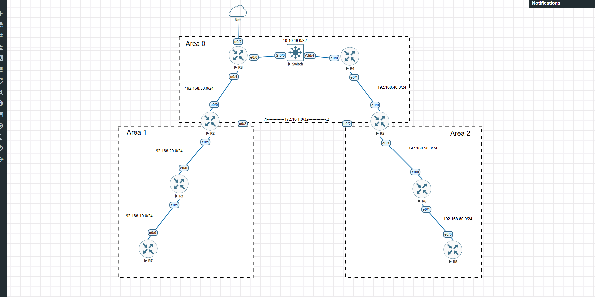

# Nornir EVE Telnet/SSH Automation

This repository contains an automation setup using [Nornir](https://nornir.readthedocs.io) to manage and configure multiple Cisco IOS devices via Telnet. It is designed to work in an EVE-NG/PNETLab lab environment and the connection to devices is by telnet (The default mode when you create a lab). I created this because I used to spend a lot of time configuring SSH on a device by device basis so I could use my other scripts that use SSH.

In the Inventory folder, there are three files: defaults.yaml, groups.yaml, and hosts.yaml. You need to modify hosts.yaml to match your topology and the correct Telnet ports for each device, and define the correct interface, IP and mask for each device. Inside defaults.yaml, you can set the credentials you wish to use. If you don't change them, the username and password will default to admin. If you want to use differents user and pass to each device, you need define it inside the hosts.yaml file, adding the username and password lines that already exist on defaults.yaml file.
Notice that the enable password is set in configure_ssh.py (line 18). You can modify this value as well, if desired.

## Overview

- **Language**: Python 3
- **Automation Framework**: [Nornir](https://nornir.readthedocs.io)
- **Connection Library**: [Netmiko](https://github.com/ktbyers/netmiko)
- **Topology**: Created and emulated in EVE-NG/PNETLab (Wasn't tested on GNS3 or others)

### Main Features

1. **Telnet Configuration**: Sets up or modifies devices (hostname, domain name, etc.) via Telnet for initial access.  
2. **SSH Transition**: Generates RSA keys, enables SSH, and can switch `transport input` to `ssh telnet`.  
3.**Management Interface Configuration**: Automates the assignment of a management IP address on a specified interface, which includes:
   - Setting the `ip address`.
   - Defining the subnet mask.
   - Enabling the interface with `no shutdown`. 

## Topology

Below is an example of the lab topology in EVE-NG where I tested the script:

> In this topology, R1, R2, R4, R5, R6, R7, and R8 are connected via various subnets and OSPF. R3 is bridging to the "cloud" interface that provides DHCP and external connectivity to an Ubuntu VM running Nornir.

## Installation & Usage

1. **Clone** this repository:
   
   git clone https://github.com/YOUR_USERNAME/Nornir-EVE-Telnet-SSH.git
   
   cd Nornir-EVE-Telnet-SSH

## Create and activate a Python virtual environment
  python3 -m venv venv
  source venv/bin/activate

## Install requirements:

  pip install -r requirements.txt

  This installs Nornir, Netmiko, and other dependencies.

## Configure:

Update nornir.yaml if needed.
Edit inventory/hosts.yaml to match your device IPs/ports (Note: EVE-NG/PNETLab dynamically assigns the ports; you can find them by hovering your mouse over the device, checking the bottom-left corner for EVE.)

## Run:
  
  python configure_ssh.py

  (Add execute permission first (chmod +x configure_ssh.py))

